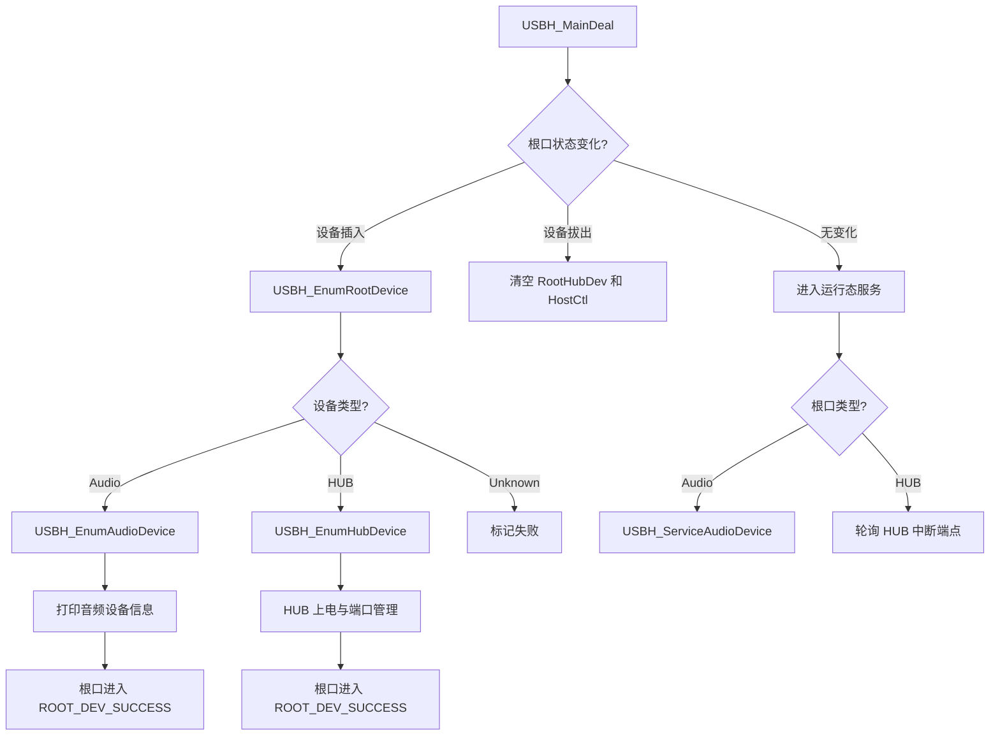
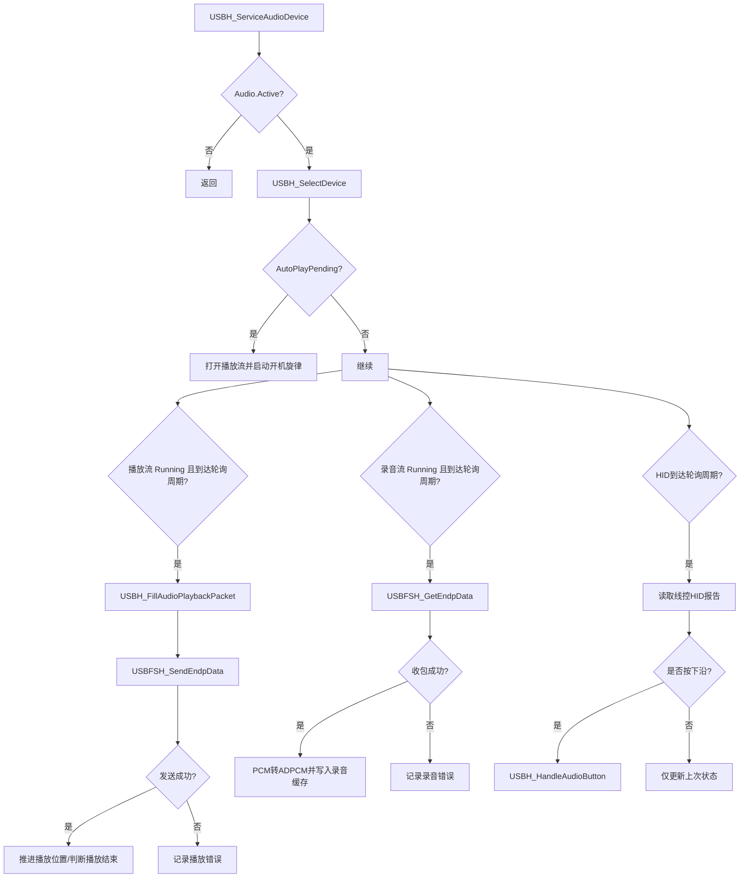

# CH32H417 USB 音频专用例程运行流程说明

## 1. 文档目的

本文档用于说明当前 USB 音频专用例程的完整运行流程，重点覆盖：

- 程序从上电到进入主循环的启动链路
- Type-C 口如何建立主机角色
- 根口设备如何完成枚举
- 音频耳机如何解析成播放流、录音流和线控 HID
- 运行阶段各函数在什么时机被调用
- 每个关键函数的输入、作用、调用时机和结果
- HUB 下挂音频设备时，流程如何变化

本文档以当前工程中的以下文件为主线：

- `V3F/User/main.c`
- `Common/hardware.c`
- `Common/USB_Host/app_audio.c`
- `Common/USB_Host/usb_host_config.h`

## 2. 整体运行总览

可以先把整个工程理解成 5 层：

1. 启动入口层
   - `main()`
2. 硬件初始化层
   - `Hardware()`
   - `USBFS_TypeC_SourceInit()`
3. 主机状态机层
   - `USBH_MainDeal()`
4. 音频设备应用层
   - `USBH_EnumAudioDevice()`
   - `USBH_ServiceAudioDevice()`
   - `USBH_HandleAudioButton()`
5. USBFS Host 底层传输层
   - `USBFSH_*` 系列函数

这 5 层的关系是：

- `main()` 只负责把系统带起来，然后进入 `Hardware()`
- `Hardware()` 做 Type-C 与 USBFS Host 初始化，然后循环调用 `USBH_MainDeal()`
- `USBH_MainDeal()` 负责设备插拔检测、枚举和运行态调度
- 音频专用逻辑主要集中在 `app_audio.c`
- 实际 USB 控制传输和端点收发则由底层 `USBFSH_*` 完成

## 3. 启动流程图

```mermaid
flowchart TD
    A[上电复位] --> B[main]
    B --> C[SystemInit]
    C --> D[SystemAndCoreClockUpdate]
    D --> E[Delay_Init]
    E --> F[USART_Printf_Init]
    F --> G[Hardware]
    G --> H[TIM3_Init]
    H --> I[USBFS_TypeC_SourceInit]
    I --> J[USBFS_RCC_Init]
    J --> K[USBFS_Host_Init]
    K --> L[清空 RootHubDev 和 HostCtl]
    L --> M[while(1)]
    M --> N[USBH_MainDeal]
    N --> M
```

## 4. 启动阶段函数说明

### 4.1 `main()`

文件：`V3F/User/main.c`

调用时机：
- MCU 上电复位后最先进入的 C 层入口函数

核心功能：
- 完成系统时钟更新
- 初始化延时模块
- 初始化串口打印
- 在双核模式下可唤醒 V5F
- 调用 `Hardware()` 进入本工程硬件初始化主线

效果：
- 系统具备基础运行和串口调试能力
- 正式转入 USB 音频专用流程

### 4.2 `Hardware()`

文件：`Common/hardware.c`

调用时机：
- `main()` 完成基础系统初始化后调用

核心功能：
- 打印编译时间、编译器版本和音频工程版本号
- 调用 `TIM3_Init()` 建立 1ms 软时基
- 调用 `USBFS_TypeC_SourceInit()` 建立 Type-C 主机角色
- 调用 `USBFS_RCC_Init()` 和 `USBFS_Host_Init()` 启动 USBFS Host
- 清空根口设备状态和主机控制块
- 进入无限循环，持续调用 `USBH_MainDeal()`

效果：
- 让 Type-C 口和 USBFS Host 都处于可工作状态
- 把整个程序推进到“轮询式 USB 主机”运行阶段

### 4.3 `USBFS_TypeC_SourceInit()`

文件：`Common/hardware.c`

调用时机：
- `Hardware()` 初始化 USBFS Host 之前调用

核心功能：
- 使能 GPIOB / AFIO / USBPD 时钟
- 将 `PB3/PB4` 配置为 `USBPD CC1/CC2`
- 在 `CC1/CC2` 上配置 `Rp`
- 告诉外部 Type-C 设备“当前板子是 Source / 主机”

效果：
- 数字 Type-C 耳机才会真正上线到 `D+ / D-`
- 如果没有这一步，USB 音频设备通常不会开始枚举

### 4.4 `TIM3_Init()`

文件：`Common/USB_Host/app_audio.c`

调用时机：
- `Hardware()` 初始阶段调用

核心功能：
- 配置 TIM3 为 1ms 更新一次
- 打开更新中断
- 启动 TIM3

效果：
- 为全工程建立统一的 1ms 软件时基
- 后续所有“轮询某个端点是否到时”的逻辑都依赖这里

### 4.5 `TIM3_IRQHandler()`

文件：`Common/USB_Host/app_audio.c`

调用时机：
- TIM3 每 1ms 触发一次中断

核心功能：
- 如果根口已经枚举成功，则给对应音频设备调用 `USBH_AudioTick()`
- 如果根口挂的是 HUB，则给 HUB 中断端点计时
- 同时给 HUB 下级音频设备调用 `USBH_AudioTick()`

效果：
- 不直接做 USB 事务
- 只是给运行态的端点轮询计数器加 1

## 5. 根口设备运行总流程图



## 6. 枚举阶段函数说明

### 6.1 `USBH_MainDeal()`

文件：`Common/USB_Host/app_audio.c`

调用时机：
- `Hardware()` 里的无限循环中，被反复调用

核心功能：
- 检查根口插拔状态
- 当检测到新设备插入时，发起根口枚举
- 根据设备类型分流到音频枚举或 HUB 枚举
- 当设备已经进入成功态后，进入运行阶段服务
- 当设备拔出时，清空状态结构

效果：
- 它是整个 USB 音频例程的“总调度器”
- 所有后续流程都由它推进

### 6.2 `USBH_EnumRootDevice()`

文件：`Common/USB_Host/app_audio.c`

调用时机：
- `USBH_MainDeal()` 检测到根口新设备接入时调用

核心功能：
- 读取设备描述符
- 设置设备地址
- 读取配置描述符
- 调用 `USBH_AnalyseType()` 判断设备类型
- 设置配置值

效果：
- 完成标准 USB 枚举的根口版本
- 把根口设备归类为：`Audio / HUB / Unknown`

### 6.3 `USBH_AnalyseType()`

文件：`Common/USB_Host/app_audio.c`

调用时机：
- `USBH_EnumRootDevice()` 和 `USBH_EnumHubPortDevice()` 中

核心功能：
- 遍历配置描述符中的接口描述符
- 判断接口类是否包含 Audio 或 HUB
- 输出最终设备类型

效果：
- 避免简单设备判断逻辑误判复合音频设备
- 让“耳机 + 麦克风 + 线控 HID”这种复合设备被正确归为 Audio

### 6.4 `USBH_EnumAudioDevice()`

文件：`Common/USB_Host/app_audio.c`

调用时机：
- 根口设备被识别为 Audio 后调用
- HUB 下级设备被识别为 Audio 后也调用

核心功能：
- 清空并初始化 `HostCtl[index].Audio`
- 解析 Audio Control 接口
- 解析播放流接口
- 解析录音流接口
- 解析 HID 线控接口
- 保存 Feature Unit 与源端关系
- 计算播放/录音包长
- 读取 HID 报告描述符长度
- 打印播放流、录音流和 HID 控制接口信息
- 标记 `AutoPlayPending`

效果：
- 把“配置描述符里的原始字节信息”转换成“后续运行态可以直接使用的结构化状态”

### 6.5 `USBH_PrintDeviceSummary()`

调用时机：
- 枚举阶段读取配置描述符成功后调用

核心功能：
- 打印设备 VID/PID
- 打印每个接口的 Class / SubClass / Protocol / Endpoints

效果：
- 用于观察一个 USB 设备到底暴露了哪些接口

### 6.6 `USBH_PrintAudioDeviceInfo()`

调用时机：
- 音频设备枚举成功后调用

核心功能：
- 只聚焦打印音频设备相关接口

效果：
- 便于确认播放接口、录音接口、线控接口是否都被识别到

## 7. 音频运行阶段流程图



## 8. 运行阶段函数说明

### 8.1 `USBH_ServiceAudioDevice()`

文件：`Common/USB_Host/app_audio.c`

调用时机：
- 根口音频设备成功枚举后，在 `USBH_MainDeal()` 中持续调用
- HUB 下级音频设备成功枚举后，也在 `USBH_MainDeal()` 中持续调用

核心功能分 3 部分：

#### 8.1.1 开机旋律部分
- 若 `AutoPlayPending` 为 1，且播放流有效，就先打开播放流
- 进入 `AUDIO_TEST_BOOT_MELODY`
- 持续发送内部合成旋律
- 播放结束后自动回到 `AUDIO_TEST_READY`

#### 8.1.2 播放服务部分
- 当播放流 `Running` 且达到轮询周期时
- 调用 `USBH_FillAudioPlaybackPacket()` 生成一个播放包
- 调用 `USBFSH_SendEndpData()` 发给耳机
- 发包成功后更新播放位置
- 判断是否播放结束

#### 8.1.3 录音服务部分
- 当录音流 `Running` 且达到轮询周期时
- 调用 `USBFSH_GetEndpData()` 从麦克风取一包 PCM 数据
- 将 PCM 转成 ADPCM 保存到录音缓存
- 统计录音样本数、录音字节数和峰值
- 达到录音上限时自动结束录音

#### 8.1.4 HID 服务部分
- 周期性读取线控 HID 报告
- 第一包只作为初始状态，不触发动作
- 只有检测到按下沿才触发 `USBH_HandleAudioButton()`

效果：
- 它是音频设备进入运行态后的核心服务函数
- 音频数据收发和按键控制都集中在这里完成

### 8.2 `USBH_AudioTick()`

调用时机：
- 由 `TIM3_IRQHandler()` 每 1ms 调用

核心功能：
- 增加播放流、录音流和 HID 的时间计数器
- 减少 HID 去抖计时

效果：
- 给 `USBH_ServiceAudioDevice()` 提供“是否到轮询时间”的依据

### 8.3 `USBH_FillAudioPlaybackPacket()`

调用时机：
- `USBH_ServiceAudioDevice()` 的播放分支中

核心功能：
- 如果当前是开机旋律状态，则调用 `USBH_GetBootMelodySample()` 生成 PCM
- 如果当前是录音回放状态，则从 ADPCM 录音缓存里解码成 PCM
- 把 PCM 按声道数组织成一个完整 USB 音频播放包

效果：
- 把“要播什么”转换成“这 1ms 应该往耳机发哪一包数据”

### 8.4 `USBH_GetBootMelodySample()`

调用时机：
- 开机旋律阶段由 `USBH_FillAudioPlaybackPacket()` 调用

核心功能：
- 根据当前播放进度生成旋律采样点

效果：
- 不需要外部音频文件，也能验证播放链路

### 8.5 `USBH_ApplySampleGain()`

调用时机：
- 录音回放解码后调用

核心功能：
- 根据增益系数放大样本值
- 做上下限裁剪，避免溢出

效果：
- 提高录音回放的可听度

### 8.6 `USBH_CalcPlaybackGain()`

调用时机：
- 每次录音结束时调用

核心功能：
- 根据本次录音峰值估算回放增益

效果：
- 让不同音量的录音回放时尽量都能听清

### 8.7 `USBH_FinishRecording()`

调用时机：
- 录音时线控再次按下
- 或录音达到最大时长自动触发

核心功能：
- 停止录音流
- 更新录音字节数
- 计算回放增益
- 切换状态到 `AUDIO_TEST_READY`
- 打印录音统计信息

效果：
- 结束录音，进入“可回放”状态

## 9. 线控按键状态机

### 9.1 `USBH_HandleAudioButton()`

调用时机：
- `USBH_ServiceAudioDevice()` 检测到 HID 按下沿后调用

状态转换如下：

- 当前状态为 `AUDIO_TEST_RECORDING`
  - 调用 `USBH_FinishRecording()`
  - 效果：停止录音并进入 `READY`

- 当前状态为 `AUDIO_TEST_READY` 且已有录音数据
  - 停掉麦克风流
  - 打开播放流
  - 状态切到 `AUDIO_TEST_PLAYBACK`
  - 效果：开始播放上一段录音

- 其他情况
  - 停掉播放流
  - 打开录音流
  - 清空录音统计
  - 状态切到 `AUDIO_TEST_RECORDING`
  - 效果：开始新一轮录音

## 10. 音频流控制函数

### 10.1 `USBH_AudioSetStreamState()`

调用时机：
- 开机旋律启动时
- 按键开始录音时
- 按键停止录音时
- 按键开始回放时
- 播放结束时
- 录音自动结束时

开启流时做什么：

1. `USBH_SelectDevice()` 选中目标设备
2. `USBFSH_SetInterface()` 切到对应 AltSetting
3. 如有采样率，则调用 `USBH_AudioSetSampleFreq()`
4. 如果是播放流，尝试设置播放 Feature Unit
5. 如果是录音流，尝试设置录音 Feature Unit
6. 初始化 Toggle、计数器、错误统计

关闭流时做什么：

1. `USBFSH_SetInterface()` 切回 Alt0
2. 清掉 `Running` 标志

效果：
- 它是音频流开关的统一入口

### 10.2 `USBH_AudioSetSampleFreq()`

调用时机：
- `USBH_AudioSetStreamState()` 开流时

核心功能：
- 通过标准 UAC1 `SET_CUR` 控制请求设置采样率

效果：
- 让设备的播放流和录音流真正按目标采样率工作

### 10.3 `USBH_AudioSetFeatureMute()` / `USBH_AudioSetFeatureVolume()`

调用时机：
- `USBH_AudioSetStreamState()` 中

核心功能：
- 通过 Feature Unit 设置静音和音量

效果：
- 让耳机播放/录音从“接口存在”推进到“真能出声、真能收音”

## 11. HUB 分支运行流程

如果根口接入的是 HUB，则流程会比直接接入音频耳机多一层：

### 11.1 `USBH_EnumHubDevice()`

调用时机：
- 根口被识别成 HUB 后调用

核心功能：
- 解析 HUB 配置描述符
- 读取 HUB 描述符
- 获取端口数量
- 给各端口上电

### 11.2 `HUB_AnalyzeConfigDesc()`

调用时机：
- `USBH_EnumHubDevice()` 中

核心功能：
- 找出 HUB 的中断输入端点

### 11.3 `HUB_Port_PreEnum1()` / `HUB_Port_PreEnum2()`

调用时机：
- `USBH_MainDeal()` 的 HUB 运行分支中

核心功能：
- 检测 HUB 某个端口是否有新设备插入
- 做复位和状态确认

### 11.4 `HUB_CheckPortSpeed()`

调用时机：
- 某个 HUB 端口确认接入后调用

核心功能：
- 读取端口状态，判断设备速率

### 11.5 `USBH_EnumHubPortDevice()`

调用时机：
- HUB 下级端口新设备需要枚举时调用

核心功能：
- 对 HUB 下级设备执行与根口类似的标准枚举

### 11.6 HUB 下的音频设备

一旦某个 HUB 下级设备被识别为 `USB_DEV_CLASS_AUDIO`：

- 继续调用 `USBH_EnumAudioDevice()`
- 运行阶段继续调用 `USBH_ServiceAudioDevice()`

也就是说：

- HUB 只负责“把下级设备带上线”
- 真正的音频处理逻辑仍然复用和根口相同的音频专用路径

## 12. 关键数据结构在流程中的作用

### 12.1 `ROOT_HUB_DEVICE RootHubDev`

作用：
- 保存根口当前设备状态
- 如果根口是 HUB，则继续保存各下级端口设备状态

使用阶段：
- 插拔检测
- 枚举结果记录
- 运行态设备调度

### 12.2 `HOST_CTL HostCtl[]`

作用：
- 保存每个逻辑设备的通用端点信息和音频专用状态

其中最关键的是：
- `HostCtl[index].Audio`

### 12.3 `AUDIO_CTL`

作用：
- 保存单个音频设备的完整运行时状态

包括：
- `Play`：播放流状态
- `Record`：录音流状态
- `Hid`：线控状态
- `TestState`：录音/回放测试状态机
- `RecordDataLen` / `RecordSampleCount`：录音统计
- `PlaybackGain`：回放增益
- `PlayFeatureUnitId` / `RecordFeatureUnitId`：Feature Unit

## 13. 最常见的调试观察点

### 13.1 启动阶段

应看到：

- `Build Time`
- `Audio Host Rev`
- `USBFS HOST AUDIO Test`
- `TIM3 Init OK!`
- `Type-C SRC Init: CC1/CC2 Rp enabled.`
- `USBFS Host Init`

### 13.2 枚举阶段

应看到：

- `USB Port Dev In.`
- `Enum:`
- `Get DevDesc:`
- `Get CfgDesc:`
- `DevType:`
- `Root Device Is Audio(Headset). Further Enum:`

### 13.3 音频枚举阶段

应看到：

- `Play IF:...`
- `Mic IF:...`
- `Ctrl IF:...`
- `Audio Demo: boot melody pending.`
- `Audio Host Base Ready.`

### 13.4 运行阶段

应看到：

- `Audio Demo: start boot melody 5000ms.`
- `Audio Demo: boot melody done.`
- `Headset HID:`
- `Audio Test: start record...`
- `Audio Test: record done...`
- `Audio Test: start playback...`
- `Audio Test: playback done.`

## 14. 最简学习路径

如果你是 USB 音频初学者，建议按下面顺序读：

1. `main()`
   - 理解程序从哪里进入
2. `Hardware()`
   - 理解为什么 Type-C 初始化必须在 USBFS Host 之前
3. `USBH_MainDeal()`
   - 理解整个主机状态机如何调度
4. `USBH_EnumRootDevice()`
   - 理解标准 USB 枚举
5. `USBH_AnalyseType()`
   - 理解如何从配置描述符判断设备类型
6. `USBH_EnumAudioDevice()`
   - 理解音频耳机如何被拆成播放、录音、HID 三部分
7. `USBH_AudioSetStreamState()`
   - 理解音频流如何真正打开
8. `USBH_ServiceAudioDevice()`
   - 理解运行期收发包和按键处理
9. `USBH_HandleAudioButton()`
   - 理解测试状态机如何切换
10. `USBH_FillAudioPlaybackPacket()` / `USBH_ADPCMEncodeSample()` / `USBH_ADPCMDecodeSample()`
   - 理解录音回放的数据路径

## 15. 一句话总结

这份例程的本质是：

- 先把 Type-C 口建立成 USB 主机
- 再把 USB 耳机枚举成“播放流 + 录音流 + 线控 HID”
- 再通过统一状态机控制录音与回放
- 最终由 `USBH_MainDeal()` 在主循环里持续驱动整个系统运行
